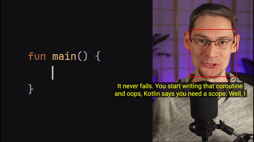

<p align="center" width="100%">
    
</p>

# Dynamic Captions for YouTube

A Chrome Extension that roughly follows the speaker's face to position the captions.

## Installation (Unpacked)

### Prerequisites

Ensure you have Node.js and NPM installed on your machine.

```bash
# Clone the repository
git clone https://github.com/Dohmanlechx/YouTube-Dynamic-Captions.git
cd YouTube-Dynamic-Captions

# Install the build dependencies (esbuild)
npm install

# Bundle the final content script into /dist
npm run build
```

### Configuration

Before building, you can adjust the extension's behavior by editing `src/config.js` to meet your needs. Each option is documented inline.

### Loading into Chrome (or any Chromium-based web browser)

1. Open a new tab in Google Chrome and navigate to `chrome://extensions/`
2. In the top right corner, toggle the switch for **Developer mode** to **ON**.
3. In the top left corner, click the **Load unpacked** button.
4. A file browser window will appear. Select the root `dynamic_captions` folder (the one containing the `manifest.json` file) and click **Select Folder**.

The extension is now installed! 

## Usage

1. Open any YouTube video and ensure the native video **Closed Captions (cc)** are turned ON.
2. Ensure there is a visible human face on screen.
3. The captions will automatically snap to the bottom of the face!
4. Use the Smiley-face icon in the YouTube player's bottom right control bar to quickly toggle the tracking on and off without reloading the page.
